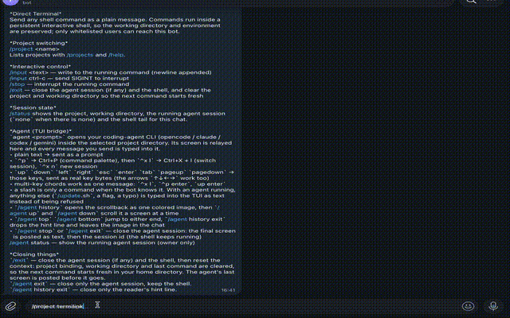

<p align="center">
  Leave the long-running agent on your machine. Drive it from anywhere.
</p>

[](https://github.com/saliherden/termilink/actions/workflows/ci.yml)
[](https://github.com/saliherden/termilink/releases)
[](go.mod)
[](LICENSE)

TermiLink is a self-hosted gateway that puts your own Mac or Linux machine in your
Telegram chat. Run terminal commands, keep a persistent shell, switch between
projects, transfer files and build artifacts, and drive an interactive coding
agent (OpenCode, Claude Code, Codex or Gemini CLI) — without exposing an inbound
port.

```text
Telegram
   │
   ▼
TermiLink
   │
   ▼
Your Mac / Linux machine
   │
   ▼
Terminal · Claude · Codex · Gemini · OpenCode
```



## Drive your coding agent from your phone

```text
/project myapp
agent fix the failing tests

🤖 Agent started. Project: myapp
[ the agent's real screen, live, as a photo ]

✓ tests passed — resume with `opencode -s ses_4f1c…`
```

TermiLink runs the real TUI — OpenCode, Claude Code, Codex or Gemini CLI — inside a pseudo-terminal rooted at the selected project and relays its screen into the chat as a photo updated in place.

See [Agent (TUI bridge)](docs/agent.md) for keys, screens and the scrollback
reader.

## Why TermiLink?

You're away from your computer and need to:

- check a running process or restart a service
- read the tail of a log
- run a command in a real shell with your environment
- ask your coding agent to fix something and watch it work
- grab a build artifact

TermiLink lets you do all of that from Telegram. It uses long-polling, so there is
no inbound port to open and no SSH exposure, and it runs as your own user with
your own toolchain. Because it executes arbitrary commands as you, read
[Security](docs/security.md) before adding a second user.

## Security at a glance

TermiLink is designed to be controlled by you, not exposed to the internet.

- User allowlist — only whitelisted Telegram user IDs are accepted.
- Dangerous-command approval — destructive commands wait for an in-chat owner
  approval before they run.
- Optional workspace restrictions — bound workers to a set of allowed roots.
- Append-only audit log — commands, approvals, denials and file transfers, with
  size-based rotation.
- Single-instance guard — a PID lock stops two gateways running at once.
- No inbound port — long-polling out to Telegram only.

Full detail, including what each control does not enforce, is in
[docs/security.md](docs/security.md).

## Quick start

Prebuilt binaries are attached to each
[release](https://github.com/saliherden/termilink/releases). With Go 1.27.1 or
newer:

```bash
go install github.com/saliherden/termilink/cmd/termilink@latest
termilink init            # writes ~/.termilink/config.yaml and .env.example
# edit ~/.termilink/config.yaml (set security.allowed_users)
# and ~/.termilink/.env (set TELEGRAM_BOT_TOKEN)
termilink start
```

Or build from a checkout — `make build` signs the binary when a local
code-signing identity exists, which keeps a macOS Full Disk Access grant across
rebuilds (`make cert-help` prints how to create one):

```bash
git clone https://github.com/saliherden/termilink.git
cd termilink
make build
./termilink init
./termilink start
```

You need a Telegram bot token from [@BotFather](https://t.me/BotFather). Only one
gateway instance may run at a time; a second `start` is rejected while the first
is running (PID lock at `~/.termilink/termilink.pid`).

To keep it running, install it as a service — launchd on macOS, systemd on Linux:

```bash
termilink service install
```

`install` copies the binary to `~/.local/bin/termilink`, outside the folders macOS
protects, and points the job there, so it does not depend on where you ran the
command. See [Run as a service](docs/service.md).

## Features

- Persistent PTY shell — one interactive shell per chat. Working directory and
  environment survive across commands; `/input` writes input and `/stop`
  interrupts.
- Agent TUI bridge — run OpenCode, Claude Code, Codex or Gemini CLI in the
  selected project and drive it from the chat. See
  [Drive your coding agent from your phone](#drive-your-coding-agent-from-your-phone).
- Scrollback reader — `/agent history` re-reads everything the agent drew, in its
  own colors, by scrolling one message.
- Project switching — `/project <name>` pins the working directory and enables
  per-project command shortcuts.
- Files and artifacts — `get` delivers build artifacts or single files, with zip
  fallback and owner-approved link delivery beyond Telegram's 50 MB; sent
  documents are saved automatically.
- Dangerous-command approval — destructive commands are queued for an owner
  decision instead of running.
- Audit logging — every command, approval, denial, file transfer and contained
  panic is written to an append-only JSONL log.
- Panic containment — a panic in a command is contained, logged with its
  stack trace, and reported to the owner.


## Platform support

| platform | status | notes |
| --- | --- | --- |
| macOS | supported | CI-tested; `termilink service install` generates and loads a launchd agent |
| Linux | supported | CI-tested on `ubuntu-24.04`; `termilink service install` generates and loads a systemd user unit |
| Windows | not supported | `creack/pty` compiles there, but `StartWithSize` returns `ErrUnsupported` at runtime, so every PTY operation fails |

The PTY library is what restricts the core to Unix, which is also why Windows is
absent from CI rather than failing in it. The Linux service renderer mirrors the
macOS one; a Windows renderer is not written yet. See
[docs/roadmap.md](docs/roadmap.md).

## Documentation

- [Install and run](docs/install.md) — development, installed and service runs,
  and releasing
- [Configuration](docs/configuration.md) — every key, type and default
- [Telegram commands](docs/commands.md) — the full command surface
- [Agent (TUI bridge)](docs/agent.md) — screens, keys and the scrollback reader
- [Files and artifacts](docs/files.md) — `get`, uploads and size limits
- [Security](docs/security.md) — roles, approval, workspace policy, audit log, and
  known limitations
- [Run as a service](docs/service.md) — launchd and systemd
- [CLI](docs/cli.md) — commands and building from source
- [Architecture](docs/architecture.md) — package map and the design decisions
- [Troubleshooting](docs/troubleshooting.md) — common problems
- [Roadmap](docs/roadmap.md) — what's next, and what is deliberately not planned

## Roadmap

macOS and Linux service support has shipped. Next up are a Windows service
renderer, scheduled tasks (a job that runs with no agent session open), and
coverage reporting in CI. The full list, including what is deliberately not
planned and why, is in [docs/roadmap.md](docs/roadmap.md).

## Contributing

Pull requests are welcome; `master` is protected and CI runs on both
`ubuntu-24.04` and `macos-latest`. See [docs/contributing.md](docs/contributing.md)
for the checks and the reasoning behind the pinned runner images.

## License

MIT. See [LICENSE](LICENSE).
